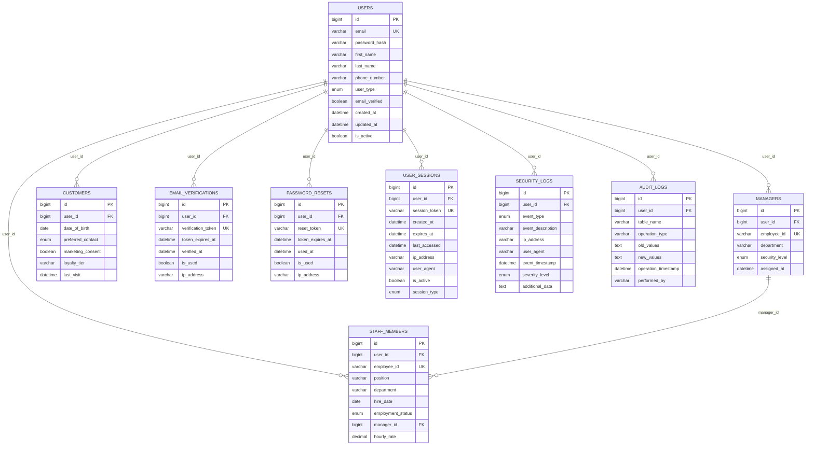

# 🗄️ Le Restaurant - Database Design

## Overview
This document outlines the database design for the Le Restaurant Management System using **Azure SQL Database** with **Java Spring Boot** framework and **JPA/Hibernate** ORM.

---

## 🏗️ Database Architecture

### Technology Stack
- **Database**: Azure SQL Database (PaaS)
- **ORM**: Spring Data JPA with Hibernate
- **Connection Pool**: HikariCP (Spring Boot default)
- **Migration**: Flyway or Liquibase
- **Backup**: Azure SQL Database automated backups

### Azure SQL Database Configuration
- **Service Tier**: Standard S2 (50 DTU) for development
- **Service Tier**: Premium P2 (250 DTU) for production  
- **Storage**: 250 GB with auto-growth enabled
- **Backup Retention**: 35 days (Azure default)
- **Geo-Replication**: Enabled for production

---

## 📊 Entity Relationship Diagram (ERD)



---

## 🗃️ Table Schemas

### 1. USERS (Core User Entity)
```sql
CREATE TABLE users (
    id BIGINT IDENTITY(1,1) PRIMARY KEY,
    email NVARCHAR(255) NOT NULL UNIQUE,
    password_hash NVARCHAR(255) NOT NULL,
    first_name NVARCHAR(100) NOT NULL,
    last_name NVARCHAR(100) NOT NULL,
    phone_number NVARCHAR(20),
    user_type NVARCHAR(20) NOT NULL CHECK (user_type IN ('MANAGER', 'CUSTOMER', 'STAFF')),
    email_verified BIT DEFAULT 0,
    created_at DATETIME2 DEFAULT GETUTCDATE(),
    updated_at DATETIME2 DEFAULT GETUTCDATE(),
    is_active BIT DEFAULT 1
);

-- Indexes
CREATE INDEX IX_users_email ON users(email);
CREATE INDEX IX_users_user_type ON users(user_type);
CREATE INDEX IX_users_created_at ON users(created_at);
```

### 2. MANAGERS (Manager-Specific Data)
```sql
CREATE TABLE managers (
    id BIGINT IDENTITY(1,1) PRIMARY KEY,
    user_id BIGINT NOT NULL,
    employee_id NVARCHAR(50) NOT NULL UNIQUE,
    department NVARCHAR(100),
    security_level NVARCHAR(20) DEFAULT 'STANDARD' CHECK (security_level IN ('STANDARD', 'ELEVATED', 'ADMIN')),
    assigned_at DATETIME2 DEFAULT GETUTCDATE(),
    FOREIGN KEY (user_id) REFERENCES users(id) ON DELETE CASCADE
);

-- Indexes
CREATE INDEX IX_managers_user_id ON managers(user_id);
CREATE INDEX IX_managers_employee_id ON managers(employee_id);
```

### 3. CUSTOMERS (Customer-Specific Data)
```sql
CREATE TABLE customers (
    id BIGINT IDENTITY(1,1) PRIMARY KEY,
    user_id BIGINT NOT NULL,
    date_of_birth DATE,
    preferred_contact NVARCHAR(20) DEFAULT 'EMAIL' CHECK (preferred_contact IN ('EMAIL', 'PHONE', 'SMS')),
    marketing_consent BIT DEFAULT 0,
    loyalty_tier NVARCHAR(20) DEFAULT 'BRONZE' CHECK (loyalty_tier IN ('BRONZE', 'SILVER', 'GOLD', 'PLATINUM')),
    last_visit DATETIME2,
    FOREIGN KEY (user_id) REFERENCES users(id) ON DELETE CASCADE
);

-- Indexes
CREATE INDEX IX_customers_user_id ON customers(user_id);
CREATE INDEX IX_customers_loyalty_tier ON customers(loyalty_tier);
```

### 4. STAFF_MEMBERS (Staff-Specific Data)
```sql
CREATE TABLE staff_members (
    id BIGINT IDENTITY(1,1) PRIMARY KEY,
    user_id BIGINT NOT NULL,
    employee_id NVARCHAR(50) NOT NULL UNIQUE,
    position NVARCHAR(100) NOT NULL,
    department NVARCHAR(100),
    hire_date DATE NOT NULL,
    employment_status NVARCHAR(20) DEFAULT 'ACTIVE' CHECK (employment_status IN ('ACTIVE', 'INACTIVE', 'TERMINATED', 'ON_LEAVE')),
    manager_id BIGINT,
    hourly_rate DECIMAL(10,2),
    FOREIGN KEY (user_id) REFERENCES users(id) ON DELETE CASCADE,
    FOREIGN KEY (manager_id) REFERENCES managers(id)
);

-- Indexes
CREATE INDEX IX_staff_user_id ON staff_members(user_id);
CREATE INDEX IX_staff_employee_id ON staff_members(employee_id);
CREATE INDEX IX_staff_manager_id ON staff_members(manager_id);
```

### 5. EMAIL_VERIFICATIONS (Email Verification Tokens)
```sql
CREATE TABLE email_verifications (
    id BIGINT IDENTITY(1,1) PRIMARY KEY,
    user_id BIGINT NOT NULL,
    verification_token NVARCHAR(255) NOT NULL UNIQUE,
    token_expires_at DATETIME2 NOT NULL,
    verified_at DATETIME2,
    is_used BIT DEFAULT 0,
    ip_address NVARCHAR(45),
    FOREIGN KEY (user_id) REFERENCES users(id) ON DELETE CASCADE
);

-- Indexes
CREATE INDEX IX_email_verifications_token ON email_verifications(verification_token);
CREATE INDEX IX_email_verifications_user_id ON email_verifications(user_id);
CREATE INDEX IX_email_verifications_expires ON email_verifications(token_expires_at);
```

### 6. PASSWORD_RESETS (Password Reset Tokens)
```sql
CREATE TABLE password_resets (
    id BIGINT IDENTITY(1,1) PRIMARY KEY,
    user_id BIGINT NOT NULL,
    reset_token NVARCHAR(255) NOT NULL UNIQUE,
    token_expires_at DATETIME2 NOT NULL,
    used_at DATETIME2,
    is_used BIT DEFAULT 0,
    ip_address NVARCHAR(45),
    FOREIGN KEY (user_id) REFERENCES users(id) ON DELETE CASCADE
);

-- Indexes
CREATE INDEX IX_password_resets_token ON password_resets(reset_token);
CREATE INDEX IX_password_resets_user_id ON password_resets(user_id);
CREATE INDEX IX_password_resets_expires ON password_resets(token_expires_at);
```

### 7. USER_SESSIONS (Session Management)
```sql
CREATE TABLE user_sessions (
    id BIGINT IDENTITY(1,1) PRIMARY KEY,
    user_id BIGINT NOT NULL,
    session_token NVARCHAR(255) NOT NULL UNIQUE,
    created_at DATETIME2 DEFAULT GETUTCDATE(),
    expires_at DATETIME2 NOT NULL,
    last_accessed DATETIME2 DEFAULT GETUTCDATE(),
    ip_address NVARCHAR(45),
    user_agent NVARCHAR(500),
    is_active BIT DEFAULT 1,
    session_type NVARCHAR(20) DEFAULT 'WEB' CHECK (session_type IN ('WEB', 'MOBILE', 'API')),
    FOREIGN KEY (user_id) REFERENCES users(id) ON DELETE CASCADE
);

-- Indexes
CREATE INDEX IX_sessions_token ON user_sessions(session_token);
CREATE INDEX IX_sessions_user_id ON user_sessions(user_id);
CREATE INDEX IX_sessions_expires ON user_sessions(expires_at);
CREATE INDEX IX_sessions_active ON user_sessions(is_active);
```

### 8. SECURITY_LOGS (Security Event Logging)
```sql
CREATE TABLE security_logs (
    id BIGINT IDENTITY(1,1) PRIMARY KEY,
    user_id BIGINT,
    event_type NVARCHAR(50) NOT NULL,
    event_description NVARCHAR(500),
    ip_address NVARCHAR(45),
    user_agent NVARCHAR(500),
    event_timestamp DATETIME2 DEFAULT GETUTCDATE(),
    severity_level NVARCHAR(20) DEFAULT 'INFO' CHECK (severity_level IN ('INFO', 'WARNING', 'ERROR', 'CRITICAL')),
    additional_data NVARCHAR(MAX),
    FOREIGN KEY (user_id) REFERENCES users(id) ON DELETE SET NULL
);

-- Indexes
CREATE INDEX IX_security_logs_user_id ON security_logs(user_id);
CREATE INDEX IX_security_logs_event_type ON security_logs(event_type);
CREATE INDEX IX_security_logs_timestamp ON security_logs(event_timestamp);
CREATE INDEX IX_security_logs_severity ON security_logs(severity_level);
```

### 9. AUDIT_LOGS (Data Change Auditing)
```sql
CREATE TABLE audit_logs (
    id BIGINT IDENTITY(1,1) PRIMARY KEY,
    user_id BIGINT,
    table_name NVARCHAR(100) NOT NULL,
    operation_type NVARCHAR(20) NOT NULL CHECK (operation_type IN ('INSERT', 'UPDATE', 'DELETE')),
    old_values NVARCHAR(MAX),
    new_values NVARCHAR(MAX),
    operation_timestamp DATETIME2 DEFAULT GETUTCDATE(),
    performed_by NVARCHAR(255),
    FOREIGN KEY (user_id) REFERENCES users(id) ON DELETE SET NULL
);

-- Indexes
CREATE INDEX IX_audit_logs_user_id ON audit_logs(user_id);
CREATE INDEX IX_audit_logs_table_name ON audit_logs(table_name);
CREATE INDEX IX_audit_logs_timestamp ON audit_logs(operation_timestamp);
```

---

## 🔧 Spring Boot JPA Entities

### Base Entity
```java
@MappedSuperclass
@EntityListeners(AuditingEntityListener.class)
public abstract class BaseEntity {
    @Id
    @GeneratedValue(strategy = GenerationType.IDENTITY)
    private Long id;
    
    @CreatedDate
    @Column(name = "created_at", nullable = false, updatable = false)
    private LocalDateTime createdAt;
    
    @LastModifiedDate
    @Column(name = "updated_at")
    private LocalDateTime updatedAt;
    
    // getters and setters
}
```

### User Entity
```java
@Entity
@Table(name = "users")
@Inheritance(strategy = InheritanceType.JOINED)
@DiscriminatorColumn(name = "user_type", discriminatorType = DiscriminatorType.STRING)
public class User extends BaseEntity {
    
    @Column(unique = true, nullable = false)
    private String email;
    
    @Column(name = "password_hash", nullable = false)
    private String passwordHash;
    
    @Column(name = "first_name", nullable = false)
    private String firstName;
    
    @Column(name = "last_name", nullable = false)
    private String lastName;
    
    @Column(name = "phone_number")
    private String phoneNumber;
    
    @Enumerated(EnumType.STRING)
    @Column(name = "user_type", nullable = false)
    private UserType userType;
    
    @Column(name = "email_verified")
    private Boolean emailVerified = false;
    
    @Column(name = "is_active")
    private Boolean isActive = true;
    
    // relationships, getters and setters
}
```

---

## 🚀 Database Migration Strategy

### Flyway Migration Scripts
```
src/main/resources/db/migration/
├── V1__Create_users_table.sql
├── V2__Create_managers_table.sql
├── V3__Create_customers_table.sql
├── V4__Create_staff_members_table.sql
├── V5__Create_email_verifications_table.sql
├── V6__Create_password_resets_table.sql
├── V7__Create_user_sessions_table.sql
├── V8__Create_security_logs_table.sql
├── V9__Create_audit_logs_table.sql
└── V10__Insert_initial_data.sql
```

### Application Properties
```properties
# Azure SQL Database Configuration
spring.datasource.url=jdbc:sqlserver://le-restaurant-db.database.windows.net:1433;database=le-restaurant;encrypt=true;trustServerCertificate=false;hostNameInCertificate=*.database.windows.net;loginTimeout=30;
spring.datasource.username=${AZURE_SQL_USERNAME}
spring.datasource.password=${AZURE_SQL_PASSWORD}
spring.datasource.driver-class-name=com.microsoft.sqlserver.jdbc.SQLServerDriver

# JPA/Hibernate Configuration
spring.jpa.hibernate.ddl-auto=validate
spring.jpa.show-sql=false
spring.jpa.properties.hibernate.dialect=org.hibernate.dialect.SQLServerDialect
spring.jpa.properties.hibernate.format_sql=true

# Flyway Configuration
spring.flyway.enabled=true
spring.flyway.locations=classpath:db/migration
```

---

## 📈 Performance Optimization

### Indexing Strategy
- **Primary Keys**: Clustered indexes on all ID columns
- **Foreign Keys**: Non-clustered indexes on all FK columns
- **Search Columns**: Indexes on email, employee_id, session_token
- **Date Columns**: Indexes on created_at, expires_at for efficient queries

### Query Optimization
- **Pagination**: Use OFFSET/FETCH for large result sets
- **Batch Operations**: Use batch inserts for bulk operations
- **Connection Pooling**: HikariCP with optimal pool size
- **Read Replicas**: Consider Azure SQL read replicas for reporting

---

## 🔒 Security Considerations

### Data Protection
- **Encryption at Rest**: Azure SQL Database transparent data encryption
- **Encryption in Transit**: SSL/TLS connections required
- **Password Hashing**: BCrypt with salt rounds ≥ 10
- **Token Security**: Cryptographically secure random tokens

### Access Control
- **Database Users**: Separate users for application and admin access
- **Row Level Security**: Consider for multi-tenant scenarios
- **Audit Trails**: Comprehensive logging of all data changes

---

## 📊 Monitoring and Maintenance

### Azure SQL Database Monitoring
- **Azure SQL Analytics**: Performance monitoring and insights
- **Query Performance Insight**: Identify slow queries
- **Automatic Tuning**: Enable for performance optimization
- **Backup Monitoring**: Verify automated backup success

### Maintenance Tasks
- **Index Maintenance**: Regular index rebuilds/reorganization
- **Statistics Update**: Automated statistics updates
- **Cleanup Jobs**: Remove expired tokens and old sessions
- **Growth Monitoring**: Monitor database size and DTU usage

---

## 🔄 Backup and Recovery

### Azure SQL Database Backup
- **Automatic Backups**: Full, differential, and log backups
- **Point-in-Time Restore**: Up to 35 days retention
- **Geo-Restore**: Cross-region restore capability
- **Long-term Retention**: Optional for compliance requirements

### Recovery Procedures
- **RTO**: Recovery Time Objective < 1 hour
- **RPO**: Recovery Point Objective < 15 minutes
- **Testing**: Regular backup restore testing
- **Documentation**: Detailed recovery procedures 