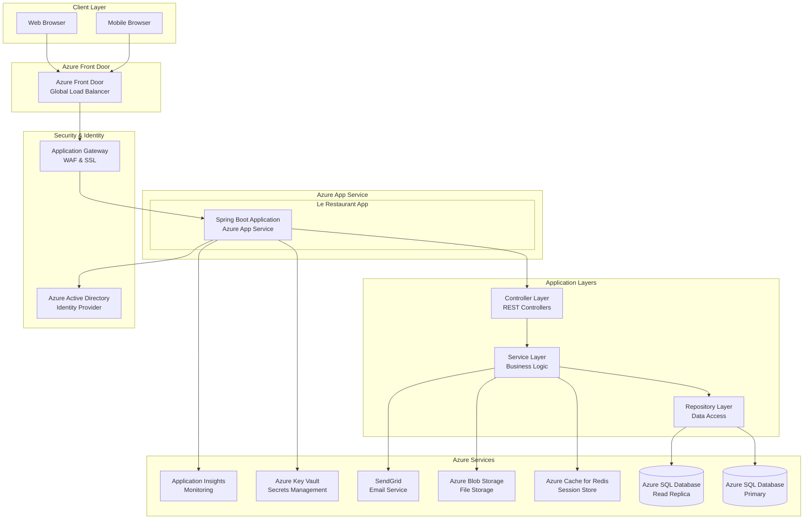
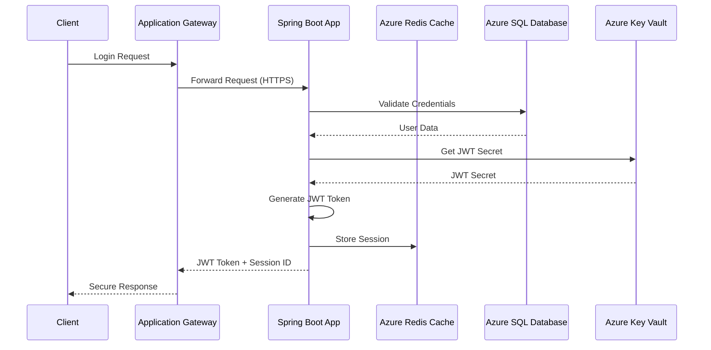
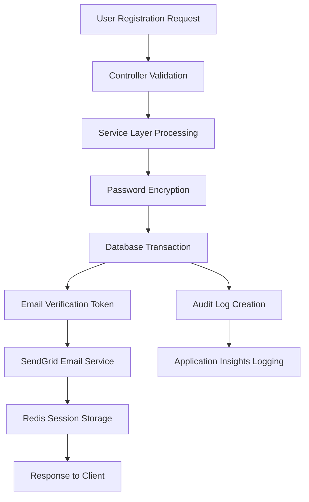
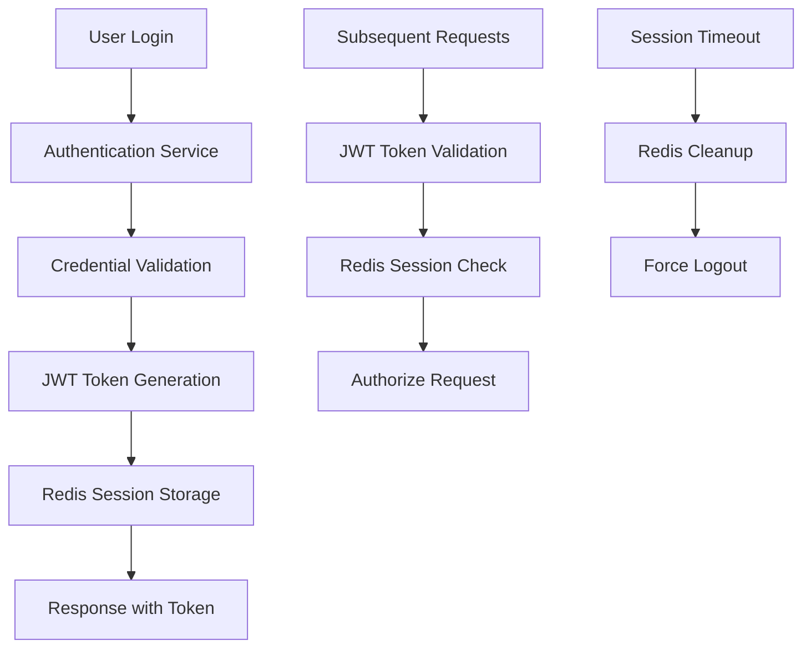

# 🏗️ Le Restaurant - System Architecture

## Overview
This document outlines the system architecture for the Le Restaurant Management System built with **Java Spring Boot** and deployed on **Microsoft Azure** cloud platform.

---

## 🌐 High-Level Architecture

### Architecture Pattern
- **Pattern**: Layered Architecture with MVC (Model-View-Controller)
- **Style**: Microservices-ready monolithic application
- **Deployment**: Cloud-native on Azure Platform-as-a-Service (PaaS)

### Technology Stack
- **Backend**: Java 17+ with Spring Boot 3.x
- **Frontend**: Thymeleaf with Bootstrap 5 (Server-side rendering)
- **Database**: Azure SQL Database
- **Cloud Platform**: Microsoft Azure
- **Build Tool**: Maven or Gradle
- **Application Server**: Embedded Tomcat

---

## 🏛️ System Architecture Diagram



---

## 🔧 Application Architecture

### Spring Boot Application Structure
```
src/main/java/com/lerestaurant/
├── LeRestaurantApplication.java
├── config/
│   ├── SecurityConfig.java
│   ├── DatabaseConfig.java
│   ├── RedisConfig.java
│   └── AzureConfig.java
├── controller/
│   ├── AuthController.java
│   ├── UserController.java
│   ├── ManagerController.java
│   └── StaffController.java
├── service/
│   ├── UserService.java
│   ├── AuthenticationService.java
│   ├── EmailService.java
│   └── SessionService.java
├── repository/
│   ├── UserRepository.java
│   ├── SessionRepository.java
│   └── SecurityLogRepository.java
├── entity/
│   ├── User.java
│   ├── Manager.java
│   ├── Customer.java
│   └── StaffMember.java
├── dto/
│   ├── UserRegistrationDto.java
│   ├── LoginDto.java
│   └── UserProfileDto.java
├── security/
│   ├── JwtTokenProvider.java
│   ├── CustomUserDetailsService.java
│   └── SecurityEventListener.java
└── util/
    ├── PasswordEncoder.java
    ├── TokenGenerator.java
    └── ValidationUtils.java
```

### Layered Architecture Details

#### 1. Presentation Layer (Controllers)
```java
@RestController
@RequestMapping("/api/auth")
@Validated
public class AuthController {
    
    @Autowired
    private AuthenticationService authService;
    
    @PostMapping("/register")
    public ResponseEntity<UserDto> register(@Valid @RequestBody UserRegistrationDto dto) {
        UserDto user = authService.registerUser(dto);
        return ResponseEntity.ok(user);
    }
    
    @PostMapping("/login")
    public ResponseEntity<AuthResponse> login(@Valid @RequestBody LoginDto dto) {
        AuthResponse response = authService.authenticate(dto);
        return ResponseEntity.ok(response);
    }
}
```

#### 2. Service Layer (Business Logic)
```java
@Service
@Transactional
public class AuthenticationService {
    
    @Autowired
    private UserRepository userRepository;
    
    @Autowired
    private PasswordEncoder passwordEncoder;
    
    @Autowired
    private JwtTokenProvider tokenProvider;
    
    public UserDto registerUser(UserRegistrationDto dto) {
        // Business logic for user registration
        User user = new User();
        user.setEmail(dto.getEmail());
        user.setPasswordHash(passwordEncoder.encode(dto.getPassword()));
        // ... additional logic
        
        User savedUser = userRepository.save(user);
        return mapToDto(savedUser);
    }
}
```

#### 3. Repository Layer (Data Access)
```java
@Repository
public interface UserRepository extends JpaRepository<User, Long> {
    
    Optional<User> findByEmail(String email);
    
    List<User> findByUserTypeAndIsActive(UserType userType, Boolean isActive);
    
    @Query("SELECT u FROM User u WHERE u.createdAt BETWEEN :startDate AND :endDate")
    List<User> findUsersByDateRange(@Param("startDate") LocalDateTime startDate, 
                                   @Param("endDate") LocalDateTime endDate);
}
```

---

## ☁️ Azure Services Integration

### 1. Azure App Service Configuration
```yaml
# azure-pipelines.yml
trigger:
- main

pool:
  vmImage: 'ubuntu-latest'

variables:
  azureSubscription: 'le-restaurant-subscription'
  webAppName: 'le-restaurant-app'
  resourceGroupName: 'le-restaurant-rg'

stages:
- stage: Build
  jobs:
  - job: Build
    steps:
    - task: Maven@3
      inputs:
        mavenPomFile: 'pom.xml'
        goals: 'clean package'
        
- stage: Deploy
  jobs:
  - job: Deploy
    steps:
    - task: AzureWebApp@1
      inputs:
        azureSubscription: $(azureSubscription)
        appName: $(webAppName)
        package: '$(System.DefaultWorkingDirectory)/**/*.jar'
```

### 2. Application Configuration
```properties
# application-azure.properties

# Azure App Service Configuration
server.port=${PORT:8080}
spring.profiles.active=azure

# Azure SQL Database
spring.datasource.url=${AZURE_SQL_CONNECTION_STRING}
spring.datasource.username=${AZURE_SQL_USERNAME}
spring.datasource.password=${AZURE_SQL_PASSWORD}

# Azure Cache for Redis
spring.redis.host=${AZURE_REDIS_HOST}
spring.redis.port=6380
spring.redis.password=${AZURE_REDIS_PASSWORD}
spring.redis.ssl=true

# Azure Key Vault
azure.keyvault.uri=${AZURE_KEYVAULT_URI}
azure.keyvault.client-id=${AZURE_CLIENT_ID}
azure.keyvault.client-secret=${AZURE_CLIENT_SECRET}

# Application Insights
azure.application-insights.instrumentation-key=${APPINSIGHTS_INSTRUMENTATION_KEY}

# SendGrid Email Service
spring.sendgrid.api-key=${SENDGRID_API_KEY}
```

### 3. Azure Services Setup

#### Azure Resource Group Structure
```bash
# Resource Group: le-restaurant-rg
├── App Service Plan: le-restaurant-plan (Premium P1V2)
├── App Service: le-restaurant-app
├── SQL Server: le-restaurant-sql-server
├── SQL Database: le-restaurant-db
├── Redis Cache: le-restaurant-redis
├── Storage Account: lerestaurantstorage
├── Key Vault: le-restaurant-keyvault
├── Application Insights: le-restaurant-insights
└── Front Door: le-restaurant-frontdoor
```

---

## 🔐 Security Architecture

### Authentication & Authorization Flow


### Security Configuration
```java
@Configuration
@EnableWebSecurity
@EnableMethodSecurity
public class SecurityConfig {
    
    @Bean
    public SecurityFilterChain filterChain(HttpSecurity http) throws Exception {
        http
            .csrf(csrf -> csrf.disable())
            .sessionManagement(session -> 
                session.sessionCreationPolicy(SessionCreationPolicy.STATELESS))
            .authorizeHttpRequests(authz -> authz
                .requestMatchers("/api/auth/**").permitAll()
                .requestMatchers("/api/public/**").permitAll()
                .requestMatchers("/api/manager/**").hasRole("MANAGER")
                .requestMatchers("/api/staff/**").hasRole("STAFF")
                .anyRequest().authenticated())
            .oauth2ResourceServer(oauth2 -> oauth2
                .jwt(jwt -> jwt.jwtAuthenticationConverter(jwtAuthConverter())))
            .addFilterBefore(jwtAuthenticationFilter(), 
                           UsernamePasswordAuthenticationFilter.class);
        
        return http.build();
    }
}
```

---

## 📊 Data Flow Architecture

### User Registration Flow


### Session Management Flow


---

## 🚀 Deployment Architecture

### Azure App Service Deployment
```dockerfile
# Dockerfile
FROM openjdk:17-jre-slim

# Install required packages
RUN apt-get update && apt-get install -y curl && rm -rf /var/lib/apt/lists/*

# Create app directory
WORKDIR /app

# Copy application jar
COPY target/le-restaurant-*.jar app.jar

# Expose port
EXPOSE 8080

# Health check
HEALTHCHECK --interval=30s --timeout=3s --start-period=5s --retries=3 \
  CMD curl -f http://localhost:8080/actuator/health || exit 1

# Run application
ENTRYPOINT ["java", "-jar", "app.jar"]
```

### Infrastructure as Code (ARM Template)
```json
{
  "$schema": "https://schema.management.azure.com/schemas/2019-04-01/deploymentTemplate.json#",
  "contentVersion": "1.0.0.0",
  "parameters": {
    "appName": {
      "type": "string",
      "defaultValue": "le-restaurant"
    }
  },
  "resources": [
    {
      "type": "Microsoft.Web/serverfarms",
      "apiVersion": "2021-02-01",
      "name": "[concat(parameters('appName'), '-plan')]",
      "location": "[resourceGroup().location]",
      "sku": {
        "name": "P1v2",
        "capacity": 1
      }
    },
    {
      "type": "Microsoft.Web/sites",
      "apiVersion": "2021-02-01",
      "name": "[concat(parameters('appName'), '-app')]",
      "location": "[resourceGroup().location]",
      "dependsOn": [
        "[resourceId('Microsoft.Web/serverfarms', concat(parameters('appName'), '-plan'))]"
      ],
      "properties": {
        "serverFarmId": "[resourceId('Microsoft.Web/serverfarms', concat(parameters('appName'), '-plan'))]"
      }
    }
  ]
}
```

---

## 📈 Scalability & Performance

### Horizontal Scaling Strategy
- **Auto Scaling**: Azure App Service auto-scaling based on CPU/Memory
- **Load Balancing**: Azure Front Door for global load distribution
- **Database Scaling**: Azure SQL Database read replicas
- **Caching**: Azure Cache for Redis for session and data caching

### Performance Optimization
```java
@Configuration
@EnableCaching
public class CacheConfig {
    
    @Bean
    public CacheManager cacheManager(RedisConnectionFactory connectionFactory) {
        RedisCacheConfiguration config = RedisCacheConfiguration.defaultCacheConfig()
            .serializeKeysWith(RedisSerializationContext.SerializationPair
                .fromSerializer(new StringRedisSerializer()))
            .serializeValuesWith(RedisSerializationContext.SerializationPair
                .fromSerializer(new GenericJackson2JsonRedisSerializer()))
            .entryTtl(Duration.ofMinutes(30));
            
        return RedisCacheManager.builder(connectionFactory)
            .cacheDefaults(config)
            .build();
    }
}
```

---

## 🔍 Monitoring & Observability

### Application Insights Integration
```java
@Component
public class CustomTelemetryInitializer implements TelemetryInitializer {
    
    @Override
    public void initialize(Telemetry telemetry) {
        if (telemetry instanceof RequestTelemetry) {
            RequestTelemetry requestTelemetry = (RequestTelemetry) telemetry;
            // Add custom properties
            requestTelemetry.getProperties().put("application", "le-restaurant");
            requestTelemetry.getProperties().put("version", "1.0.0");
        }
    }
}
```

### Health Checks Configuration
```java
@Component
public class CustomHealthIndicator implements HealthIndicator {
    
    @Autowired
    private UserRepository userRepository;
    
    @Override
    public Health health() {
        try {
            long userCount = userRepository.count();
            return Health.up()
                .withDetail("database", "Available")
                .withDetail("userCount", userCount)
                .build();
        } catch (Exception e) {
            return Health.down()
                .withDetail("database", "Unavailable")
                .withException(e)
                .build();
        }
    }
}
```

---

## 🔄 CI/CD Pipeline

### Azure DevOps Pipeline
```yaml
# azure-pipelines.yml
trigger:
  branches:
    include:
    - main
    - develop

variables:
  buildConfiguration: 'Release'
  azureSubscription: 'le-restaurant-subscription'

stages:
- stage: Build
  displayName: 'Build and Test'
  jobs:
  - job: Build
    pool:
      vmImage: 'ubuntu-latest'
    steps:
    - task: Maven@3
      displayName: 'Maven Build'
      inputs:
        mavenPomFile: 'pom.xml'
        goals: 'clean compile test package'
        publishJUnitResults: true
        testResultsFiles: '**/surefire-reports/TEST-*.xml'
        
    - task: PublishCodeCoverageResults@1
      inputs:
        codeCoverageTool: 'JaCoCo'
        summaryFileLocation: 'target/site/jacoco/jacoco.xml'
        
- stage: Deploy
  displayName: 'Deploy to Azure'
  dependsOn: Build
  condition: and(succeeded(), eq(variables['Build.SourceBranch'], 'refs/heads/main'))
  jobs:
  - deployment: Deploy
    environment: 'production'
    pool:
      vmImage: 'ubuntu-latest'
    strategy:
      runOnce:
        deploy:
          steps:
          - task: AzureWebApp@1
            inputs:
              azureSubscription: $(azureSubscription)
              appType: 'webApp'
              appName: 'le-restaurant-app'
              package: '$(Pipeline.Workspace)/**/*.jar'
```

---

## 🛡️ Disaster Recovery & Backup

### Backup Strategy
- **Database**: Azure SQL Database automated backups (35-day retention)
- **Application**: Source code in Azure DevOps Git repositories
- **Configuration**: Infrastructure as Code templates in version control
- **Secrets**: Azure Key Vault with backup policies

### Recovery Procedures
- **RTO (Recovery Time Objective)**: < 1 hour
- **RPO (Recovery Point Objective)**: < 15 minutes
- **Geo-Redundancy**: Multi-region deployment capability
- **Failover**: Automated failover with Azure Traffic Manager

---

## 📋 Architecture Decision Records (ADRs)

### ADR-001: Azure Platform Selection
- **Status**: Accepted
- **Decision**: Use Azure as primary cloud platform
- **Rationale**: Enterprise support, SQL Server compatibility, integrated services

### ADR-002: Monolithic vs Microservices
- **Status**: Accepted
- **Decision**: Start with monolithic architecture, design for microservices migration
- **Rationale**: Faster initial development, easier deployment and monitoring

### ADR-003: Database Choice
- **Status**: Accepted  
- **Decision**: Azure SQL Database
- **Rationale**: Managed service, automatic backups, built-in security features

---

This architecture provides a solid foundation for the Le Restaurant Management System with scalability, security, and maintainability built-in from the start. 