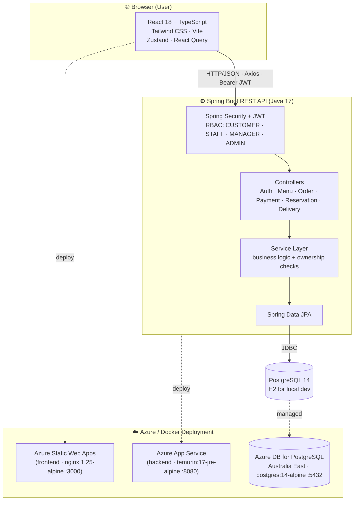
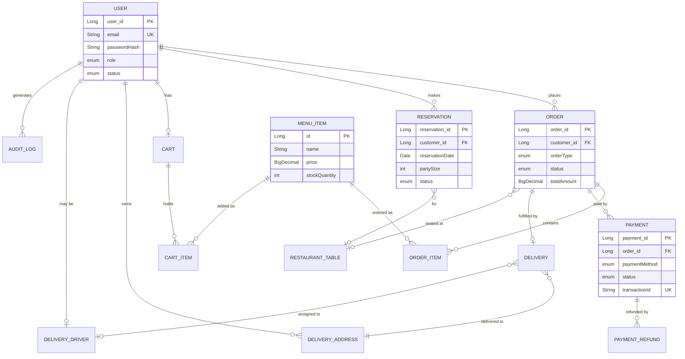
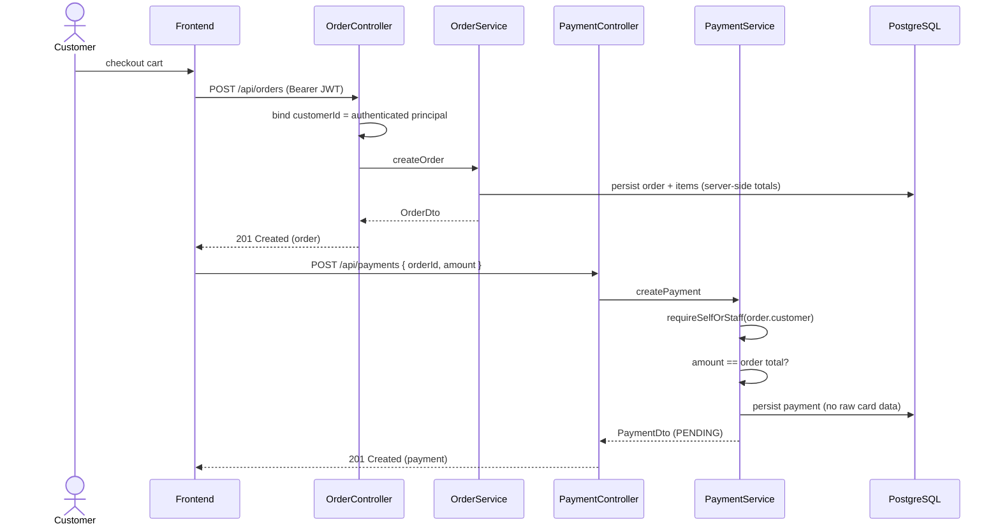

<div align="center">


</div>

<div align="center">


[](https://github.com/aaronurayan/le-restaurant/actions/workflows/ci.yml)
[](https://github.com/aaronurayan/le-restaurant/actions/workflows/azure-deploy.yml)
[](https://github.com/aaronurayan/le-restaurant/actions/workflows/docker-publish.yml)
[](https://github.com/aaronurayan/le-restaurant/actions/workflows/release.yml)
[](#-license)


**한국어** | [English](README.en.md) | [日本語](README.ja.md) | [Русский](README.ru.md)

</div>

---

## Overview

Le Restaurant is a full-stack restaurant management system built by 5 UTS students for the Advanced Software Development course. The system helps customers browse the menu, place orders, make table reservations, and track deliveries. Restaurant managers can manage menus, users, payments, and reservations from a single dashboard.

The project uses **Spring Boot** (Java 17) for the backend API and **React + TypeScript** for the frontend. All data is stored in **PostgreSQL** and the application is deployed on **Microsoft Azure**.

---

## 🚀 Quick Start

### 🌐 Live Deployment (Azure)

The application is currently live on Azure:

- **Frontend**: https://le-restaurant-frontend.azurestaticapps.net
- **Backend API**: https://le-restaurant-adbrdddye6cbdjf2.australiaeast-01.azurewebsites.net
- **API Docs (Swagger)**: https://le-restaurant-adbrdddye6cbdjf2.australiaeast-01.azurewebsites.net/swagger-ui/index.html

### 🐳 Run with Docker (Recommended for Local)

The easiest way to run the full stack locally is Docker Compose. You only need **Docker** installed.

```bash
# Clone the repository
git clone https://github.com/aaronurayan/le-restaurant.git
cd le-restaurant

# Create the .env file (the backend requires a JWT signing secret and fails fast without it)
cp .env.example .env
# then edit .env and set JWT_SECRET to a random value >= 32 bytes, e.g. `openssl rand -base64 48`

# Start the entire stack (PostgreSQL + Backend + Frontend)
docker compose up --build

# When done
docker compose down
```

After the containers start:
- **Frontend**: http://localhost:3000
- **Backend API**: http://localhost:8080
- **Health Check**: http://localhost:8080/api/health

### 💻 Local Development (Without Docker)

#### Prerequisites
- Java 17+
- Node.js 18+
- Git

```bash
# Clone the repository
git clone https://github.com/aaronurayan/le-restaurant.git
cd le-restaurant

# Start the Backend (uses H2 in-memory database by default)
cd backend
./gradlew bootRun
# Backend runs on http://localhost:8080

# In a new terminal, start the Frontend
cd frontend
npm install
npm run dev
# Frontend runs on http://localhost:5173
```

#### Access Points
- **Frontend**: http://localhost:5173
- **Backend API**: http://localhost:8080
- **API Documentation**: http://localhost:8080/swagger-ui/index.html
- **Health Check**: http://localhost:8080/api/health

---

## 🏗️ Architecture

### System Architecture



### Entity Relationship Diagram



### Sequence — Authentication (JWT login)

```mermaid
sequenceDiagram
    actor C as Customer
    participant FE as React Frontend
    participant API as AuthController
    participant US as UserService
    participant JWT as JwtUtil
    participant DB as PostgreSQL

    C->>FE: enter email + password
    FE->>API: POST /api/auth/login
    API->>US: authenticateUser(email, password)
    US->>DB: findByEmail
    DB-->>US: user
    US->>US: bcrypt match? account ACTIVE?
    US->>DB: save lastLogin + AUTH_LOGIN audit
    US-->>API: UserDto
    API->>JWT: generateToken(email, role)
    JWT-->>API: signed JWT (HS256)
    API-->>FE: 200 { user, token }
    FE->>FE: store token; send as Bearer on requests
```

### Sequence — Order → Payment



### Design Patterns Used

| Pattern | Where we used it |
|---------|-----------------|
| Atomic Design | React components (Atoms → Molecules → Organisms → Pages) |
| Repository Pattern | Spring Data JPA repositories |
| Service Layer | Business logic separated from controllers |
| DTO Pattern | Request/response objects for all API endpoints |
| Dependency Injection | Spring IoC container |
| Singleton | Unified API client in frontend |

---

## 📁 Project Structure

```
le-restaurant/
├── backend/                          # Spring Boot API (Java 17)
│   ├── src/main/java/
│   │   ├── controller/              # REST controllers (11 total)
│   │   ├── service/                 # Business logic (9 services)
│   │   ├── repository/              # Data access (18 repositories)
│   │   ├── entity/                  # Database models (18 entities)
│   │   ├── dto/                     # Request/Response objects (50+)
│   │   └── config/                  # Security, CORS, OpenAPI
│   ├── src/test/java/               # Unit + E2E tests (33 test files)
│   ├── Dockerfile
│   └── build.gradle
│
├── frontend/                         # React 18 + TypeScript
│   ├── src/
│   │   ├── components/
│   │   │   ├── atoms/               # Basic UI elements (Button, Input...)
│   │   │   ├── molecules/           # Composite components (MenuCard, OrderCard...)
│   │   │   ├── organisms/           # Complex sections (Header, AdminDashboard...)
│   │   │   └── templates/           # Page layouts
│   │   ├── pages/                   # Route components (12 pages)
│   │   ├── hooks/                   # Custom React hooks (17 hooks)
│   │   ├── services/                # API client and services
│   │   ├── contexts/                # Auth and Cart global state
│   │   └── types/                   # TypeScript type definitions
│   ├── Dockerfile
│   └── package.json
│
├── e2e/                              # Playwright browser E2E tests
│   ├── tests/                       # 4 test spec files
│   └── playwright.config.ts
│
├── integration-tests/                # Jest API integration tests
│   └── *.test.js                    # 5 test files (health, auth, menu, orders, reservations)
│
├── docs/                             # 50+ documentation files
├── docker-compose.yml                # Full stack Docker setup
├── azure-pipelines.yml               # CI/CD pipeline (Azure DevOps)
└── README.md
```

---

## 🎯 Key Features

### 👤 User Management (F100–F102)
- **F100 – User Registration**: Create an account with email, password, name, and phone number. Includes a **password strength indicator** (Weak / Fair / Good / Strong).
- **F101 – Authentication**: Secure login with JWT tokens. Includes **Remember me** (30-day session) and **Forgot Password** reset flow. A **session timeout warning** appears after 25 minutes of inactivity. Deactivated or suspended accounts cannot log in.
- **F102 – User Management**: Managers can view, edit, deactivate, reactivate, and delete customer accounts. Customers can view their **login history** (last 20 logins) from their dashboard.

### 🍽️ Menu Management (F103–F104)
- **F103 – Menu Display**: Browse menu items by category. Search by name. See price, description, and availability.
- **F104 – Menu Management**: Managers can add, edit, and delete menu items.

### 🛒 Order & Payment (F105–F106)
- **F105 – Order Management**: Add items to cart, place orders, and track status (Pending → Preparing → Ready → Completed).
- **F106 – Payment Management**: Pay with credit card, debit card, cash, bank transfer, or digital wallet. Managers can process refunds and view **full payment details**.

### 🚚 Delivery Management (F107)
- **F107 – Delivery Tracking**: Assign delivery drivers to orders, track delivery status in real time, and manage customer addresses.

### 📅 Table Reservation (F108–F109)
- **F108 – Reservation Booking**: Customers choose a date, time, and party size to book a table.
- **F109 – Reservation Management**: Managers approve or deny reservations. Customers can view **full reservation details** from their booking history.

---

## 🛠️ Tech Stack

| Layer | Technology |
|-------|-----------|
| Backend language | Java 17 |
| Backend framework | Spring Boot 3.x |
| Security | Spring Security + JWT (jjwt) |
| Database (prod) | PostgreSQL 14 |
| Database (dev) | H2 (in-memory) |
| ORM | Spring Data JPA (Hibernate) |
| API docs | Swagger / SpringDoc OpenAPI |
| Build tool | Gradle |
| Frontend language | TypeScript 5.x |
| Frontend framework | React 18 |
| Build tool | Vite 7.x |
| CSS | Tailwind CSS 3.x |
| HTTP client | Axios |
| Forms | React Hook Form |
| State management | Zustand + React Context |
| Icons | Lucide React |
| Containerisation | Docker + Docker Compose |
| Cloud hosting | Microsoft Azure |
| CI/CD | Azure DevOps Pipelines |
| Unit testing (backend) | JUnit 5 + Mockito + JaCoCo |
| Unit testing (frontend) | Vitest + Testing Library |
| Browser E2E testing | Playwright |
| API integration testing | Jest + Axios |

---

## 🧪 Testing Strategy

We follow a three-layer testing approach:

```
         Browser E2E Tests (Playwright)      ← 4 spec files, real browser
        ─────────────────────────────────
       API Integration Tests (Jest)          ← 5 test files, live backend
      ────────────────────────────────────
     Unit Tests + E2E Scenarios (JUnit)      ← 33 test files, mocked/real DB
    ─────────────────────────────────────
   Frontend Component Tests (Vitest)         ← 23 test files
```

**CI/CD Pipeline Stages** (`azure-pipelines.yml`):
1. **Code Quality** — ESLint (frontend) + Checkstyle (backend)
2. **Build & Test** — Unit tests (80% coverage required), E2E Java scenarios, JS integration tests
3. **Browser E2E** — Playwright tests against a running full stack
4. **Security Scan** — `npm audit` + OWASP dependency check

---

## 👥 Team Roles

| Role | Name | Responsibilities |
|------|------|-----------------|
| **Project Manager & Developer** | **Jungwook Van** | System architecture, CI/CD pipelines, branch integration, documentation · F102 (User Management) · F106 (Payment Management) |
| Developer | Aaron Urayan | F107 (Delivery Management) · F109 (Reservation Management) · GitHub repository setup |
| Developer | Damaq Zain | F105 (Order Management) · F108 (Table Reservation) |
| Developer | Junayeed Halim | F100 (User Registration) · F101 (User Authentication) · Azure Pipelines CI setup |
| Developer | Mikhail Zhelnin | F103 (Menu Display) · F104 (Menu Management) |

---

## 📅 Project Timeline

| Phase | Period | What We Did |
|-------|--------|-------------|
| Phase 1 — Planning | Aug 2025 (Weeks 1–2) | Set up the GitHub repository, wrote the Software Requirements Specification (SRS), designed the database schema and system architecture. Defined 10 features (F100–F109) and assigned each to a team member. |
| Phase 2 — Prototype | Sep 2025 (Weeks 3–4) | Built a working Spring Boot backend skeleton and React frontend prototype. Configured Azure Pipelines CI and pushed the first working prototype to the repo. |
| Phase 3 — Development | Oct 2025 (Weeks 5–8) | Each team member developed their assigned features on separate branches. We merged everything into `main`, fixed integration bugs, and wrote unit tests and 10 end-to-end scenario tests. |
| Phase 4 — Testing & Polish | Nov 2025 (Weeks 9–10) | Ran all E2E scenario tests, fixed remaining frontend bugs, improved the UI, and added multilingual documentation (Korean, Japanese, Russian). |
| Phase 5 — Finalisation | Dec 2025 (Weeks 11–12) | Added the remaining planned features (password strength indicator, payment details view, reservation details view). Set up Docker packaging, GitHub Container Registry, and automated release. Completed all documentation. |

**Total project duration**: August 2025 – December 2025 (5 months)

---

## 📚 Documentation

All project documentation is in the [`docs/`](docs/) directory:

- **📖 Master Index**: [`docs/00-MASTER-INDEX.md`](docs/00-MASTER-INDEX.md)
- **📋 Requirements (SRS)**: [`docs/REQUIREMENTS/`](docs/REQUIREMENTS/)
- **🏗️ Architecture & Design**: [`docs/REQUIREMENTS/system-architecture/`](docs/REQUIREMENTS/system-architecture/)
- **🧪 Testing**: [`docs/testing/`](docs/testing/)
- **🚀 Deployment Guide**: [`docs/AZURE_DEPLOYMENT_GUIDE.md`](docs/AZURE_DEPLOYMENT_GUIDE.md)

---

## 🎓 Academic Project

This project was developed for **41026 Advanced Software Development** at the University of Technology Sydney (UTS), Spring Semester 2025.

- **Course**: [41026 Advanced Software Development](https://coursehandbook.uts.edu.au/subject/2026/41026) (6 Credit Points)
- **Institution**: University of Technology Sydney (UTS)
- **Semester**: Spring 2025
- **Project Type**: Collaborative Group Assignment

This is an academic project developed by UTS students and is not intended for commercial use.

---

## 📄 License

Developed for academic purposes as part of the UTS Advanced Software Development course.

---

**Last Updated**: 2025-12-25
