# 🏗️ System Architecture Design

> **Reference Document**: Technical architecture specification for Le Restaurant ordering system with Azure DevOps integration.

## 📐 Architecture Overview

### System Architecture Pattern
**Pattern**: Layered Architecture with Microservices Readiness  
**Style**: RESTful API with MVC Frontend  
**Deployment**: Cloud-Native on Azure Platform  

---

## 🏛️ Architectural Layers

```
┌─────────────────────────────────────────────────────────────────┐
│                      Presentation Layer                        │
│  ┌─────────────────┐  ┌─────────────────┐  ┌─────────────────┐ │
│  │   Web Client    │  │  Mobile Client  │  │  Admin Portal   │ │
│  │   (React/HTML)  │  │   (Future)      │  │    (React)      │ │
│  └─────────────────┘  └─────────────────┘  └─────────────────┘ │
└─────────────────────────────────────────────────────────────────┘
                                │
                                ▼
┌─────────────────────────────────────────────────────────────────┐
│                        API Gateway Layer                       │
│  ┌─────────────────────────────────────────────────────────────┐ │
│  │              Spring Boot REST API                          │ │
│  │  ┌─────────────┐  ┌─────────────┐  ┌─────────────────────┐ │ │
│  │  │ Controllers │  │ Middleware  │  │  Security/Auth      │ │ │
│  │  └─────────────┘  └─────────────┘  └─────────────────────┘ │ │
│  └─────────────────────────────────────────────────────────────┘ │
└─────────────────────────────────────────────────────────────────┘
                                │
                                ▼
┌─────────────────────────────────────────────────────────────────┐
│                       Business Logic Layer                     │
│  ┌─────────────────┐  ┌─────────────────┐  ┌─────────────────┐ │
│  │   Menu Service  │  │  Order Service  │  │Customer Service │ │
│  └─────────────────┘  └─────────────────┘  └─────────────────┘ │
└─────────────────────────────────────────────────────────────────┘
                                │
                                ▼
┌─────────────────────────────────────────────────────────────────┐
│                      Data Access Layer                         │
│  ┌─────────────────┐  ┌─────────────────┐  ┌─────────────────┐ │
│  │  Menu Repository│  │ Order Repository│  │Customer Repo    │ │
│  │  (Spring Data)  │  │ (Spring Data)   │  │ (Spring Data)   │ │
│  └─────────────────┘  └─────────────────┘  └─────────────────┘ │
└─────────────────────────────────────────────────────────────────┘
                                │
                                ▼
┌─────────────────────────────────────────────────────────────────┐
│                        Database Layer                          │
│  ┌─────────────────────────────────────────────────────────────┐ │
│  │                   Azure SQL Database                       │ │
│  └─────────────────────────────────────────────────────────────┘ │
└─────────────────────────────────────────────────────────────────┘
```

---

## 🔧 Component Architecture

### Backend Components

#### 1. Controller Layer
```java
@RestController
@RequestMapping("/api/v1")
public class OrderController {
    // REST endpoints for order management
}

@RestController
@RequestMapping("/api/v1/menu")
public class MenuController {
    // REST endpoints for menu operations
}
```

#### 2. Service Layer
```java
@Service
public class OrderService {
    // Business logic for order processing
    // Order validation, calculation, status management
}

@Service
public class MenuService {
    // Business logic for menu management
    // Menu item availability, pricing logic
}
```

#### 3. Repository Layer
```java
@Repository
public interface OrderRepository extends JpaRepository<Order, Long> {
    // Data access methods for orders
}

@Repository
public interface MenuItemRepository extends JpaRepository<MenuItem, Long> {
    // Data access methods for menu items
}
```

### Frontend Components

#### 1. React Components Structure
```
src/
├── components/
│   ├── common/
│   │   ├── Header.jsx
│   │   ├── Footer.jsx
│   │   └── Navigation.jsx
│   ├── menu/
│   │   ├── MenuList.jsx
│   │   ├── MenuItem.jsx
│   │   └── MenuCategory.jsx
│   ├── order/
│   │   ├── Cart.jsx
│   │   ├── OrderSummary.jsx
│   │   └── OrderStatus.jsx
│   └── admin/
│       ├── Dashboard.jsx
│       ├── OrderManagement.jsx
│       └── MenuManagement.jsx
├── services/
│   ├── api.js
│   ├── orderService.js
│   └── menuService.js
├── utils/
│   ├── constants.js
│   └── helpers.js
└── styles/
    ├── global.css
    └── components.css
```

---

## 💾 Data Architecture

### Entity Relationship Diagram

#### Simplified Core ERD
```
┌─────────────────┐     ┌─────────────────┐     ┌─────────────────┐
│    Customer     │     │      Order      │     │   OrderItem     │
├─────────────────┤     ├─────────────────┤     ├─────────────────┤
│ id (PK)         │────▶│ id (PK)         │────▶│ id (PK)         │
│ name            │     │ customer_id (FK)│     │ order_id (FK)   │
│ email           │     │ order_date      │     │ menu_item_id(FK)│
│ phone           │     │ status          │     │ quantity        │
│ created_at      │     │ total_amount    │     │ unit_price      │
└─────────────────┘     │ created_at      │     │ subtotal        │
                        │ updated_at      │     └─────────────────┘
                        └─────────────────┘              │
                                 │                       │
                                 ▼                       ▼
┌─────────────────┐     ┌─────────────────┐     ┌─────────────────┐
│   MenuCategory  │     │    MenuItem     │◄────┤                 │
├─────────────────┤     ├─────────────────┤     └─────────────────┘
│ id (PK)         │────▶│ id (PK)         │
│ name            │     │ category_id (FK)│
│ description     │     │ name            │
│ display_order   │     │ description     │
│ is_active       │     │ price           │
└─────────────────┘     │ is_available    │
                        │ image_url       │
                        │ created_at      │
                        │ updated_at      │
                        └─────────────────┘
```

#### Comprehensive ERD (Mermaid)

```mermaid
erDiagram
    %% User Management Entities (F100, F101, F102)
    USERS {
        int user_id PK
        string email UK
        string password_hash
        string phone_number
        string first_name
        string last_name
        enum user_role "customer, manager, admin"
        enum status "active, inactive, suspended"
        datetime created_at
        datetime updated_at
        datetime last_login
        string profile_image_url
    }

    USER_SESSIONS {
        int session_id PK
        int user_id FK
        string session_token UK
        datetime created_at
        datetime expires_at
        string ip_address
        string user_agent
        enum status "active, expired, revoked"
    }

    %% Menu Management Entities (F103, F104)
    MENU_CATEGORIES {
        int category_id PK
        string category_name
        string description
        int sort_order
        enum status "active, inactive"
        datetime created_at
        datetime updated_at
    }

    MENU_ITEMS {
        int item_id PK
        int category_id FK
        string item_name
        text description
        decimal price
        string image_url
        text ingredients
        text allergens
        enum dietary_type "vegetarian, vegan, gluten_free, none"
        enum availability "available, out_of_stock, seasonal"
        int preparation_time_minutes
        datetime created_at
        datetime updated_at
    }

    %% Order Management Entities (F105)
    ORDERS {
        int order_id PK
        int customer_id FK
        int table_id FK "nullable for delivery"
        enum order_type "dine_in, takeout, delivery"
        decimal subtotal
        decimal tax_amount
        decimal tip_amount
        decimal total_amount
        enum status "pending, confirmed, preparing, ready, completed, cancelled"
        text special_instructions
        datetime order_time
        datetime estimated_completion
        datetime completed_at
    }

    ORDER_ITEMS {
        int order_item_id PK
        int order_id FK
        int menu_item_id FK
        int quantity
        decimal unit_price
        text customizations
        text special_requests
        datetime created_at
    }

    %% Payment Management Entities (F106)
    PAYMENTS {
        int payment_id PK
        int order_id FK
        decimal amount
        enum payment_method "credit_card, debit_card, cash, digital_wallet"
        string transaction_id UK
        enum status "pending, completed, failed, refunded"
        text payment_details "encrypted"
        datetime payment_time
        datetime processed_at
        string gateway_response
    }

    PAYMENT_REFUNDS {
        int refund_id PK
        int payment_id FK
        decimal refund_amount
        text refund_reason
        enum status "pending, completed, failed"
        datetime refund_requested
        datetime refund_processed
        int processed_by_user_id FK
    }

    %% Delivery Management Entities (F107)
    DELIVERY_ADDRESSES {
        int address_id PK
        int user_id FK
        string address_line1
        string address_line2
        string city
        string state
        string postal_code
        string country
        decimal latitude
        decimal longitude
        enum address_type "home, work, other"
        boolean is_default
        datetime created_at
    }

    DELIVERIES {
        int delivery_id PK
        int order_id FK
        int delivery_address_id FK
        int driver_id FK "nullable"
        decimal delivery_fee
        int estimated_delivery_time_minutes
        enum status "assigned, picked_up, in_transit, delivered, failed"
        text delivery_instructions
        datetime assigned_at
        datetime picked_up_at
        datetime delivered_at
        string delivery_photo_url
    }

    DELIVERY_DRIVERS {
        int driver_id PK
        int user_id FK
        string vehicle_type
        string license_plate
        enum status "available, busy, offline"
        decimal current_latitude
        decimal current_longitude
        datetime last_location_update
        datetime created_at
    }

    %% Table Reservation Entities (F108, F109)
    RESTAURANT_TABLES {
        int table_id PK
        string table_number
        int capacity
        enum table_type "regular, booth, bar, outdoor"
        enum status "available, occupied, reserved, maintenance"
        text location_description
        datetime created_at
        datetime updated_at
    }

    RESERVATIONS {
        int reservation_id PK
        int customer_id FK
        int table_id FK "nullable until assigned"
        datetime reservation_date
        time reservation_time
        int party_size
        text special_requests
        enum status "pending, confirmed, seated, completed, cancelled, no_show"
        datetime created_at
        datetime confirmed_at
        datetime checked_in_at
        int confirmed_by_user_id FK "nullable"
    }

    %% Additional Supporting Entities
    CUSTOMER_PREFERENCES {
        int preference_id PK
        int user_id FK
        string dietary_restrictions
        string favorite_cuisines
        string allergens
        boolean marketing_emails
        boolean sms_notifications
        datetime updated_at
    }

    AUDIT_LOGS {
        int log_id PK
        int user_id FK
        string entity_type
        int entity_id
        enum action_type "create, update, delete, view"
        text old_values "JSON"
        text new_values "JSON"
        string ip_address
        datetime timestamp
    }

    %% Relationships
    USERS ||--o{ USER_SESSIONS : "has"
    USERS ||--o{ ORDERS : "places"
    USERS ||--o{ RESERVATIONS : "makes"
    USERS ||--o{ DELIVERY_ADDRESSES : "has"
    USERS ||--o{ CUSTOMER_PREFERENCES : "has"
    USERS ||--o{ AUDIT_LOGS : "performs"
    USERS ||--o{ DELIVERY_DRIVERS : "can_be"
    USERS ||--o{ PAYMENT_REFUNDS : "processes"
    
    MENU_CATEGORIES ||--o{ MENU_ITEMS : "contains"
    MENU_ITEMS ||--o{ ORDER_ITEMS : "ordered_as"
    
    ORDERS ||--o{ ORDER_ITEMS : "contains"
    ORDERS ||--o{ PAYMENTS : "paid_by"
    ORDERS ||--o{ DELIVERIES : "fulfilled_by"
    ORDERS }o--|| RESTAURANT_TABLES : "assigned_to"
    
    PAYMENTS ||--o{ PAYMENT_REFUNDS : "can_have"
    
    DELIVERIES }o--|| DELIVERY_ADDRESSES : "delivered_to"
    DELIVERIES }o--|| DELIVERY_DRIVERS : "assigned_to"
    
    RESERVATIONS }o--|| RESTAURANT_TABLES : "assigned_to"
    RESERVATIONS }o--|| USERS : "confirmed_by"
```


### Database Schema

#### Tables Structure

**customers**
```sql
CREATE TABLE customers (
    id BIGINT IDENTITY(1,1) PRIMARY KEY,
    name NVARCHAR(100) NOT NULL,
    email NVARCHAR(255) UNIQUE,
    phone NVARCHAR(20),
    created_at DATETIME2 DEFAULT GETDATE(),
    updated_at DATETIME2 DEFAULT GETDATE()
);
```

**menu_categories**
```sql
CREATE TABLE menu_categories (
    id BIGINT IDENTITY(1,1) PRIMARY KEY,
    name NVARCHAR(100) NOT NULL,
    description NVARCHAR(500),
    display_order INT DEFAULT 0,
    is_active BIT DEFAULT 1,
    created_at DATETIME2 DEFAULT GETDATE()
);
```

**menu_items**
```sql
CREATE TABLE menu_items (
    id BIGINT IDENTITY(1,1) PRIMARY KEY,
    category_id BIGINT NOT NULL,
    name NVARCHAR(100) NOT NULL,
    description NVARCHAR(500),
    price DECIMAL(10,2) NOT NULL,
    is_available BIT DEFAULT 1,
    image_url NVARCHAR(500),
    created_at DATETIME2 DEFAULT GETDATE(),
    updated_at DATETIME2 DEFAULT GETDATE(),
    FOREIGN KEY (category_id) REFERENCES menu_categories(id)
);
```

**orders**
```sql
CREATE TABLE orders (
    id BIGINT IDENTITY(1,1) PRIMARY KEY,
    customer_id BIGINT,
    order_date DATETIME2 DEFAULT GETDATE(),
    status NVARCHAR(50) DEFAULT 'PENDING',
    total_amount DECIMAL(10,2) NOT NULL,
    created_at DATETIME2 DEFAULT GETDATE(),
    updated_at DATETIME2 DEFAULT GETDATE(),
    FOREIGN KEY (customer_id) REFERENCES customers(id)
);
```

**order_items**
```sql
CREATE TABLE order_items (
    id BIGINT IDENTITY(1,1) PRIMARY KEY,
    order_id BIGINT NOT NULL,
    menu_item_id BIGINT NOT NULL,
    quantity INT NOT NULL,
    unit_price DECIMAL(10,2) NOT NULL,
    subtotal DECIMAL(10,2) NOT NULL,
    FOREIGN KEY (order_id) REFERENCES orders(id),
    FOREIGN KEY (menu_item_id) REFERENCES menu_items(id)
);
```

---

## 🔌 API Architecture

### REST API Endpoints

#### Menu Management
```
GET    /api/v1/menu/categories          # Get all menu categories
GET    /api/v1/menu/categories/{id}     # Get specific category
GET    /api/v1/menu/items               # Get all menu items
GET    /api/v1/menu/items/{id}          # Get specific menu item
GET    /api/v1/menu/categories/{id}/items # Get items by category
```

#### Order Management
```
POST   /api/v1/orders                   # Create new order
GET    /api/v1/orders/{id}              # Get order details
PUT    /api/v1/orders/{id}/status       # Update order status
GET    /api/v1/orders                   # Get orders (with pagination)
DELETE /api/v1/orders/{id}              # Cancel order
```

#### Customer Management
```
POST   /api/v1/customers                # Create customer
GET    /api/v1/customers/{id}           # Get customer details
PUT    /api/v1/customers/{id}           # Update customer
GET    /api/v1/customers/{id}/orders    # Get customer orders
```

### API Response Format
```json
{
  "success": true,
  "message": "Operation completed successfully",
  "data": {
    // Response payload
  },
  "timestamp": "2025-01-27T10:30:00Z",
  "errors": []
}
```

---

## ☁️ Azure Architecture

### Azure Services Integration

```
┌─────────────────────────────────────────────────────────────────┐
│                        Azure Cloud Services                    │
│                                                                 │
│  ┌─────────────────┐  ┌─────────────────┐  ┌─────────────────┐ │
│  │   Azure DevOps  │  │  App Service    │  │  SQL Database   │ │
│  │   - Pipelines   │  │  - Web App      │  │  - Azure SQL    │ │
│  │   - Repos       │  │  - Auto Scale   │  │  - Backup       │ │
│  │   - Artifacts   │  │  - SSL/Custom   │  │  - Monitoring   │ │
│  └─────────────────┘  └─────────────────┘  └─────────────────┘ │
│                                                                 │
│  ┌─────────────────┐  ┌─────────────────┐  ┌─────────────────┐ │
│  │ App Insights    │  │  Key Vault      │  │  Storage Acc    │ │
│  │ - Monitoring    │  │  - Secrets      │  │  - Static Files │ │
│  │ - Logging       │  │  - Certificates │  │  - Backups      │ │
│  │ - Analytics     │  │  - Config       │  │  - Logs         │ │
│  └─────────────────┘  └─────────────────┘  └─────────────────┘ │
└─────────────────────────────────────────────────────────────────┘
```

### Deployment Architecture

#### Production Environment
- **Azure App Service**: Host Spring Boot application
- **Azure SQL Database**: Production database with backup
- **Application Insights**: Monitoring and telemetry
- **Azure Key Vault**: Secure configuration management

#### Development/Staging Environment
- **Azure App Service (Dev Slot)**: Development deployment
- **Azure SQL Database (Dev)**: Development database
- **Shared Application Insights**: Development monitoring

---

## 🔒 Security Architecture

### Security Layers

1. **Network Security**
   - HTTPS enforcement
   - Azure App Service security features
   - SQL Database firewall rules

2. **Application Security**
   - Spring Security configuration
   - JWT token authentication
   - Input validation and sanitization
   - CORS configuration

3. **Data Security**
   - Database encryption at rest
   - Connection string encryption
   - Sensitive data masking

### Security Implementation
```java
@Configuration
@EnableWebSecurity
public class SecurityConfig {
    
    @Bean
    public SecurityFilterChain filterChain(HttpSecurity http) throws Exception {
        http
            .csrf().disable()
            .authorizeHttpRequests(authz -> authz
                .requestMatchers("/api/v1/menu/**").permitAll()
                .requestMatchers("/api/v1/orders/**").authenticated()
                .requestMatchers("/api/v1/admin/**").hasRole("ADMIN")
            )
            .oauth2ResourceServer().jwt();
        return http.build();
    }
}
```

---

## 📊 Performance Architecture

### Performance Considerations

1. **Database Optimization**
   - Proper indexing strategy
   - Connection pooling
   - Query optimization

2. **Caching Strategy**
   - Menu items caching (Redis future)
   - Application-level caching
   - Browser caching for static assets

3. **Scalability**
   - Azure App Service auto-scaling
   - Database scaling options
   - CDN for static content

### Monitoring and Metrics
- Application response time
- Database query performance
- Error rates and exceptions
- User activity analytics

---

## 🔄 Integration Architecture

### External Integrations (Future)
- Payment processing (Stripe/PayPal)
- Email notifications (SendGrid)
- SMS notifications (Twilio)
- Analytics (Google Analytics)

### Internal Integrations
- Azure DevOps for CI/CD
- Application Insights for monitoring
- Key Vault for configuration

---

**Document Version**: 1.0  
**Last Updated**: 2025-01-27  
**Status**: Reference Architecture 